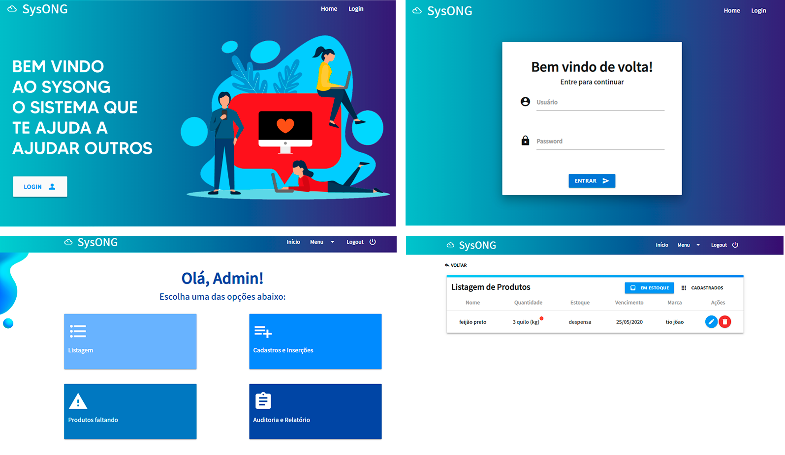

# SysOng
<p align="center">

</p>

## Do que se trata?
SYSONG é um sistema de gerenciamento e gestão de estoque para uma ONG com o objetivo de melhorar o controle das doações recebidas e por consequência, a ONG prestará um serviço ainda mais impactante e eficiente para a sociedade.

## Tecnologias

* Materialize
* Html/Css/JavaScript
* PostgreSQL

## Inicializando o projeto

Para que o sistema rode na sua máquina é necessário uma série de etapas listadas a baixo:

### Pré-Requisitos

* Sistema de Gerenciamento de Banco de dados(Mysql ou Pgsql de preferência)
* Php
* Git
* Composer
* Navegador Web(Chrome,firefox,etc)
* IDE ou Editor de Código(Opcional)

### Instalação

```
composer install
```
Após baixado,abra o arquivo **.env** dentro do projeto via Editor de código(caso não possua,utilize o bloco de notas.Dentro do arquivo mude as linhas abaixo:

```
DB_CONNECTION=pgsql ou mysql
DB_HOST=127.0.0.1   //ponha como localhost
DB_PORT=           //porta que o seu sgbd está funcionando
DB_DATABASE=      //nome do bd que você criou para o projeto
DB_USERNAME=     //nome do usuário admin do sgbd
DB_PASSWORD=    //senha do sgbd
```
Após isso,novamente no terminal/cmd utilize o comando ``php artisan migrate``, isso criará todas as tabelas necessárias no BD configurado.
Após o comando ter feito todas as migrations,use o comando ``php artisan db:seed``, para que todas as opções pré-definidas sejam configuradas nas tabelas do BD.
Por fim utilize o comando para rodar a aplicação em localhost:

```
php artisan serve
```
No navegador,cole o link: **localhost:8000** e você verá a aplicação funcionando.